# 10 Projetos de RAG — do zero ao agêntico

Guia de estudo prático. Dez repositórios independentes, cada um isolando **uma** técnica de RAG, em ordem crescente de dificuldade.

- **7 projetos em Python** com LangChain / LangGraph
- **3 projetos em Java** com Spring AI
- LLM e embeddings: **OpenAI** (`gpt-4o-mini` + `text-embedding-3-small`)
- **Vector store diferente em quase todo projeto** — parte do objetivo é conhecer vários

> Versões conferidas no PyPI e no Maven Central em **julho/2026**. Onde a versão importa, ela está fixada.

---

## Sumário

| Parte | Conteúdo |
|---|---|
| [1. Como usar](#1-como-usar-este-guia) | Ordem, tempo, o que você precisa antes |
| [2. Conceitos](#2-conceitos-base-de-rag) | O pipeline, o glossário, o diagrama |
| [3. Setup comum](#3-setup-comum) | Chave OpenAI, Python, Java, Docker |
| [4. Os 10 projetos](#4-os-10-projetos) | Uma seção por repositório |
| [A. Avaliação](#apêndice-a--avaliação-com-ragas) | Como saber se o seu RAG é bom |
| [B. Observabilidade](#apêndice-b--observabilidade) | Enxergar o que acontece por dentro |
| [C. Custos](#apêndice-c--custos-e-alternativa-local) | Quanto vai gastar e como zerar |
| [D. Erros comuns](#apêndice-d--erros-comuns) | Os tropeços que todo mundo dá |

---

## 1. Como usar este guia

**Faça na ordem.** Cada projeto existe porque resolve uma limitação concreta do anterior. Pular o 1 e ir direto no 5 é aprender a consertar um problema que você nunca viu acontecer.

| # | Projeto | Stack | Dificuldade | Tempo |
|---|---|---|---|---|
| 1 | [Fundamentos: RAG sobre PDF](#projeto-1--rag-01-fundamentos-pdf) | Python | ▁ | 2–3 h |
| 2 | [Conversacional + citações](#projeto-2--rag-02-conversacional-citacoes) | Python | ▂ | 3–4 h |
| 3 | [Busca híbrida + reranking](#projeto-3--rag-03-hybrid-rerank) | Python | ▃ | 4–5 h |
| 4 | [Documentos multimodais](#projeto-4--rag-04-multimodal-docs) | Python | ▅ | 5–6 h |
| 5 | [RAG agêntico corretivo](#projeto-5--rag-05-agentic-corrective) | Python + LangGraph | ▆ | 5–7 h |
| 6 | [Roteador multi-fonte + SQL](#projeto-6--rag-06-router-sql-multifonte) | Python + LangGraph | ▇ | 6–8 h |
| 7 | [GraphRAG](#projeto-7--rag-07-graphrag-neo4j) | Python + Neo4j | █ | 8–10 h |
| 8 | [Fundamentos em Java](#projeto-8--rag-08-springai-qa-docs) | Spring AI | ▂ | 3–4 h |
| 9 | [RAG modular](#projeto-9--rag-09-springai-rag-modular) | Spring AI | ▅ | 5–6 h |
| 10 | [Agente + servidor MCP](#projeto-10--rag-10-springai-agente-mcp) | Spring AI | █ | 7–9 h |

Os projetos Java (8–10) são autocontidos: se você já sabe RAG e quer só a versão Java, comece no 8. Se está aprendendo do zero, faça 1→7 primeiro — os conceitos são explicados lá, e o 8 assume que você já os tem.

**Cada seção traz:** o que você aprende, por que importa, o diagrama do fluxo, os comandos de criação, as dependências com versão, a árvore de arquivos, o trecho de código central comentado, o container necessário, um corpus sugerido, o critério de "funcionou" e exercícios de extensão.

**O que este guia não faz:** não é código pronto para copiar e colar inteiro. Cada projeto mostra o **núcleo da técnica** — a parte que você não conseguiria adivinhar. O código ao redor (CLI, tratamento de erro, testes) fica por sua conta, e é de propósito: é ali que o aprendizado gruda.

---

## 2. Conceitos base de RAG

### O problema

Um LLM sabe o que estava nos dados de treino dele e mais nada. Ele não conhece o PDF que você baixou ontem, nem o wiki interno da sua empresa, nem os seus e-mails. Pior: quando não sabe, ele frequentemente **inventa** uma resposta plausível em vez de dizer "não sei".

**RAG (Retrieval-Augmented Generation)** resolve isso invertendo a ordem: em vez de perguntar direto ao modelo, você primeiro **busca** os trechos relevantes nos seus documentos e depois pede ao modelo que responda **usando apenas aqueles trechos**.

### O pipeline em 5 etapas

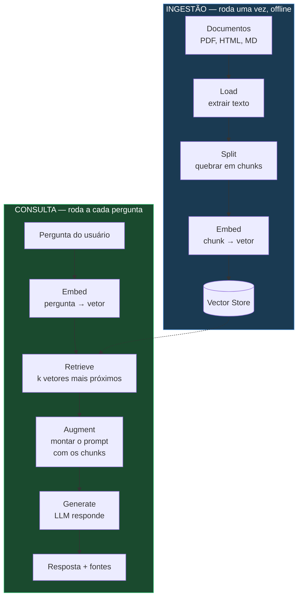

**A intuição do embedding:** um embedding transforma texto num vetor de números (1536 deles, no `text-embedding-3-small`) posicionado num espaço onde *proximidade geométrica = proximidade de significado*. "Qual o prazo de férias?" e "Quantos dias de descanso tenho direito?" caem perto no espaço, mesmo sem compartilhar nenhuma palavra. É isso que faz a busca funcionar melhor que `Ctrl+F`.

### Glossário

| Termo | O que é |
|---|---|
| **Chunk** | Pedaço do documento. A unidade que você indexa e recupera. Tamanho típico: 500–1500 caracteres. |
| **Chunk overlap** | Sobreposição entre chunks vizinhos. Evita cortar uma frase importante exatamente no meio de dois chunks. |
| **Embedding** | O vetor que representa o significado de um texto. |
| **Vector store** | Banco que guarda vetores e responde "me dê os k mais parecidos com este". |
| **top-k** | Quantos chunks você recupera por pergunta. Baixo demais = falta contexto; alto demais = ruído e custo. |
| **Busca densa** | Busca por embedding — encontra por significado. Erra em siglas, códigos e nomes próprios raros. |
| **Busca esparsa (BM25)** | Busca por palavra-chave. Acerta o termo exato, mas não entende sinônimo. |
| **Busca híbrida** | As duas juntas, com os resultados fundidos. |
| **Reranking** | Segundo passe: um modelo mais caro e mais preciso reordena os candidatos que a busca trouxe. |
| **Grounding** | O grau em que a resposta se apoia de fato nos documentos recuperados. |
| **Alucinação** | Resposta que soa correta mas não vem dos documentos nem da realidade. |
| **RAG agêntico** | RAG onde um agente **decide** o que fazer: buscar de novo, reescrever a pergunta, trocar de fonte, desistir. |

### As perguntas que os 10 projetos respondem

1. Como faço um RAG funcionar? → **Projeto 1**
2. E quando a pergunta depende do que foi dito antes? → **Projeto 2**
3. Por que ele não acha o código de erro `E-4021`? → **Projeto 3**
4. E as tabelas e imagens do PDF? → **Projeto 4**
5. E quando a busca traz lixo — dá pra ele perceber? → **Projeto 5**
6. E quando a resposta está num banco SQL, não num documento? → **Projeto 6**
7. E perguntas que exigem conectar 3 fatos de documentos diferentes? → **Projeto 7**
8. Como é tudo isso em Java? → **Projetos 8, 9, 10**

---

## 3. Setup comum

### 3.1 Chave da OpenAI

Crie a chave em <https://platform.openai.com/api-keys> e coloque **crédito** na conta (US$ 5 sobra para os 10 projetos — veja o [Apêndice C](#apêndice-c--custos-e-alternativa-local)).

Cada projeto terá um `.env` na raiz:

```bash
OPENAI_API_KEY=sk-proj-...
```

E um `.gitignore` que **sempre** inclui:

```gitignore
.env
.venv/
__pycache__/
target/
data/index/
```

> ⚠️ Uma chave da OpenAI commitada num repositório público é detectada e explorada em minutos. O `.gitignore` vem antes do primeiro `git add`.

### 3.2 Python

Seu ambiente tem **Python 3.12.3** — perfeito. Use `uv` (muito mais rápido que pip) ou o `venv` tradicional:

```bash
# opção A — uv (recomendado)
curl -LsSf https://astral.sh/uv/install.sh | sh
uv venv && source .venv/bin/activate

# opção B — venv padrão
python3 -m venv .venv && source .venv/bin/activate
```

**Base comum a todos os projetos Python:**

```bash
pip install \
  langchain==1.3.14 \
  langchain-openai==1.4.1 \
  langchain-text-splitters==1.1.2 \
  python-dotenv==1.2.2
```

> 📌 **LangChain 1.x mudou de forma.** As *chains* legadas (`RetrievalQA`, `create_retrieval_chain`) foram movidas para o pacote separado `langchain-classic`. Este guia usa o estilo **v1**: composição direta com LCEL e `create_agent`. Se você encontrar um tutorial usando `RetrievalQA`, ele é anterior à v1 — a lógica ainda vale, os imports não.

> ⚠️ **`langchain-community` e `langchain-experimental` estão em *sunset*.** Ao importar deles você verá um `DeprecationWarning` — é esperado, não é erro seu. Eles ainda funcionam e ainda são o único caminho para alguns integradores (`PyPDFLoader`, `SQLDatabase`), mas o ecossistema está migrando para pacotes autônomos por integração (`langchain-openai`, `langchain-neo4j`, `langchain-qdrant`…). Sempre que existir o pacote dedicado, prefira-o — este guia já faz isso onde é possível.

### 3.3 Java

**Boa notícia: seu Java 17 roda a stack atual.** Circula muita informação de que Spring AI 2.0 / Spring Boot 4 exigem Java 21. Isso é **falso** — Java 21 é *recomendado* (virtual threads), não exigido. Verificação direta do bytecode publicado no Maven Central:

```
spring-boot-4.1.0.jar                  → class file major 61 = Java 17
spring-ai-rag-2.0.0.jar                → class file major 61 = Java 17
spring-ai-vector-store-advisor-2.0.0   → class file major 61 = Java 17
```

Então **o Trilho A é o padrão** e você não precisa instalar nada.

| | **Trilho A — padrão ✅** | **Trilho B — legado** |
|---|---|---|
| Spring AI | `2.0.0` | `1.1.8` |
| Spring Boot | `4.1.0` | `3.5.16` |
| Java | **17** ✅ *já instalado* | 17 |
| Gerar no [start.spring.io](https://start.spring.io) | Sim | ❌ **não** — ver abaixo |

**Quando usar o Trilho B:** só se você for integrar esse aprendizado a um projeto existente ainda preso no Spring Boot 3.x. Para estudar, use o A.

> ⚠️ **O Initializr não gera mais Boot 3.5.** As versões oferecidas hoje são apenas `4.1.0` e `4.0.7` — a linha 3.5 saiu do suporte OSS. Um `spring init --boot-version=3.5.16` **falha**. Para o Trilho B você precisa gerar em 4.1.0 e rebaixar o `<parent>` e o BOM à mão no `pom.xml`.

> 💡 **Java 21 continua valendo a pena** (virtual threads, que o Boot 4 auto-configura), só não é obrigatório. Se quiser:
> ```bash
> curl -s "https://get.sdkman.io" | bash
> source "$HOME/.sdkman/bin/sdkman-init.sh"
> sdk install java 21.0.7-tem && sdk use java 21.0.7-tem
> ```

> 🔑 **A diferença mais traiçoeira entre os trilhos** é que o artefato do advisor foi **renomeado**, não apenas versionado — as palavras foram trocadas de posição:
> - Trilho B (1.1.8): `spring-ai-advisors-vector-store`
> - Trilho A (2.0.0): `spring-ai-vector-store-advisor`
>
> Copiar o `pom.xml` de um tutorial do trilho errado dá erro de resolução de dependência que parece problema de rede, mas é nome. Verificado no Maven Central: cada nome existe em **exatamente um** dos dois trilhos.

### 3.4 Docker

⚠️ **Ação necessária no seu ambiente.** O binário `docker` está no PATH do WSL, mas o daemon não responde:

```
The command 'docker' could not be found in this WSL 2 distro.
We recommend to activate the WSL integration in Docker Desktop settings.
```

**Corrija antes do Projeto 2:** abra o Docker Desktop → **Settings → Resources → WSL Integration** → ative para a sua distro → **Apply & Restart**. Confirme com:

```bash
docker version   # tem que mostrar Client E Server
```

O Projeto 1 usa Chroma **embarcado** (roda dentro do processo Python, sem container), então você consegue começar mesmo antes de resolver isso.

### 3.5 `docker-compose.yml` de referência

Não suba tudo de uma vez. Cada projeto indica o serviço dele; use `docker compose up -d <serviço>`.

```yaml
services:
  # Projeto 2 (Python) e Projeto 10 (Spring AI)
  qdrant:
    image: qdrant/qdrant:v1.18.3
    ports: ["6333:6333", "6334:6334"]
    volumes: ["qdrant_data:/qdrant/storage"]

  # Projeto 3
  elasticsearch:
    image: elasticsearch:9.4.4
    environment:
      - discovery.type=single-node
      - xpack.security.enabled=false
      - ES_JAVA_OPTS=-Xms1g -Xmx1g
    ports: ["9200:9200"]
    volumes: ["es_data:/usr/share/elasticsearch/data"]

  # Projeto 6 (Python) e Projeto 8 (Spring AI)
  postgres:
    image: pgvector/pgvector:pg17
    environment:
      POSTGRES_USER: rag
      POSTGRES_PASSWORD: rag
      POSTGRES_DB: ragdb
    ports: ["5432:5432"]
    volumes: ["pg_data:/var/lib/postgresql/data"]

  # Projeto 7
  neo4j:
    image: neo4j:5.26
    environment:
      NEO4J_AUTH: neo4j/senha12345
      NEO4J_PLUGINS: '["apoc"]'
    ports: ["7474:7474", "7687:7687"]
    volumes: ["neo4j_data:/data"]

  # Projeto 9
  redis:
    image: redis/redis-stack:latest
    ports: ["6379:6379", "8001:8001"]
    volumes: ["redis_data:/data"]

volumes:
  qdrant_data:
  es_data:
  pg_data:
  neo4j_data:
  redis_data:
```

**Interfaces web úteis:** Qdrant `http://localhost:6333/dashboard` · Neo4j `http://localhost:7474` · RedisInsight `http://localhost:8001`. Abra e **olhe os vetores** — ver o dado indexado desmistifica muita coisa.

---

## 4. Os 10 projetos

---

### Projeto 1 — `rag-01-fundamentos-pdf`

> **Trilha Python · Dificuldade ▁ · Chroma (embarcado, sem Docker)**

#### O que você aprende

O pipeline completo, na sua forma mais simples: carregar um PDF, quebrar em chunks, gerar embeddings, guardar, buscar, responder. Sem agente, sem memória, sem truque. Quando isso funcionar, você entendeu RAG.

#### Por que importa

Todos os outros nove projetos são variações e correções deste. Você também vai sentir na pele o parâmetro que mais afeta a qualidade de um RAG e que ninguém discute o suficiente: **o tamanho do chunk**.

#### Fluxo

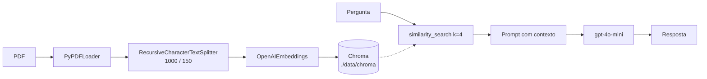

#### Criando

```bash
mkdir rag-01-fundamentos-pdf && cd rag-01-fundamentos-pdf
uv venv && source .venv/bin/activate
pip install langchain==1.3.14 langchain-openai==1.4.1 \
            langchain-text-splitters==1.1.2 langchain-chroma==1.1.0 \
            langchain-community==0.4.2 pypdf==6.14.2 python-dotenv==1.2.2
```

```
rag-01-fundamentos-pdf/
├── .env
├── .gitignore
├── docs/                  ← coloque seus PDFs aqui
├── ingest.py              ← roda uma vez: indexa
├── ask.py                 ← roda sempre: pergunta
└── data/chroma/           ← o índice (gitignored)
```

#### O núcleo — `ingest.py`

```python
from langchain_community.document_loaders import PyPDFLoader
from langchain_text_splitters import RecursiveCharacterTextSplitter
from langchain_openai import OpenAIEmbeddings
from langchain_chroma import Chroma
from dotenv import load_dotenv
from pathlib import Path

load_dotenv()

# 1. LOAD — cada página vira um Document(page_content, metadata)
docs = []
for pdf in Path("docs").glob("*.pdf"):
    docs.extend(PyPDFLoader(str(pdf)).load())

# 2. SPLIT — o parâmetro mais importante deste projeto.
#    "Recursive" = tenta quebrar em parágrafo; se o pedaço ainda for grande,
#    quebra em frase; depois em palavra. Assim respeita a estrutura do texto
#    em vez de cortar a cada N caracteres cegamente.
splitter = RecursiveCharacterTextSplitter(
    chunk_size=1000,      # ~250 tokens
    chunk_overlap=150,    # o fim de um chunk repete no começo do próximo
)
chunks = splitter.split_documents(docs)
print(f"{len(docs)} páginas → {len(chunks)} chunks")

# 3. EMBED + STORE — uma chamada de API por lote de chunks.
#    persist_directory faz o índice sobreviver ao fim do processo.
Chroma.from_documents(
    documents=chunks,
    embedding=OpenAIEmbeddings(model="text-embedding-3-small"),
    persist_directory="./data/chroma",
)
print("indexado.")
```

#### O núcleo — `ask.py`

```python
import sys
from langchain_openai import OpenAIEmbeddings, ChatOpenAI
from langchain_chroma import Chroma
from langchain_core.prompts import ChatPromptTemplate
from langchain_core.output_parsers import StrOutputParser
from langchain_core.runnables import RunnablePassthrough
from dotenv import load_dotenv

load_dotenv()

store = Chroma(
    persist_directory="./data/chroma",
    embedding_function=OpenAIEmbeddings(model="text-embedding-3-small"),
)
retriever = store.as_retriever(search_kwargs={"k": 4})

# O prompt é onde você compra o grounding. As duas últimas frases são
# o que separa "RAG" de "LLM com texto colado no prompt".
prompt = ChatPromptTemplate.from_template(
    """Responda a pergunta usando SOMENTE o contexto abaixo.
Se o contexto não contiver a resposta, diga exatamente:
"Não encontrei essa informação nos documentos."
Nunca use conhecimento próprio.

Contexto:
{context}

Pergunta: {question}"""
)

def format_docs(docs):
    return "\n\n---\n\n".join(d.page_content for d in docs)

# LCEL: o operador | encadeia os passos. A saída de um é a entrada do próximo.
chain = (
    {"context": retriever | format_docs, "question": RunnablePassthrough()}
    | prompt
    | ChatOpenAI(model="gpt-4o-mini", temperature=0)
    | StrOutputParser()
)

print(chain.invoke(sys.argv[1]))
```

```bash
python ingest.py
python ask.py "qual o prazo de garantia?"
```

#### Corpus sugerido

Um manual técnico ou uma norma de 30–80 páginas. Bons candidatos gratuitos: a LGPD, o Marco Civil da Internet, ou o manual do seu roteador. **Evite** começar com PDF escaneado (imagem sem texto) — o `PyPDFLoader` vai extrair strings vazias e você vai debugar a coisa errada. Isso é o Projeto 4.

#### Funcionou se…

- Uma pergunta cuja resposta está no PDF é respondida corretamente.
- Uma pergunta **fora** do PDF ("qual a capital da Mongólia?") retorna a frase de escape, **não** a resposta certa. Se ele responder "Ulan Bator", seu grounding falhou — o modelo está usando conhecimento próprio e você tem um gerador de alucinação, não um RAG.

#### Exercícios

1. **Sinta o chunking.** Reindexe com `chunk_size=200` e depois `4000`, mesma pergunta. Com 200 o contexto vem picado e incompleto; com 4000 vem cheio de texto irrelevante que dilui o sinal. Ache o ponto bom do *seu* documento.
2. **Imprima o que foi recuperado.** Antes da resposta, mostre os 4 chunks e o score. Quando a resposta vier errada, quase sempre a busca já tinha trazido lixo — o LLM raramente é o culpado.
3. **Adicione a fonte.** Coloque `d.metadata["source"]` e `d.metadata["page"]` no contexto e peça ao modelo para citar. É a ponte para o Projeto 2.

---

### Projeto 2 — `rag-02-conversacional-citacoes`

> **Trilha Python · Dificuldade ▂ · Qdrant (Docker)**

#### O que você aprende

Duas coisas que todo RAG de produção precisa: **memória de conversa** e **citação verificável**.

#### Por que importa

O Projeto 1 quebra no segundo turno. Observe:

> — Quantos dias de férias eu tenho?
> — 30 dias corridos.
> — **E se eu vender dez?**

A segunda pergunta, embutida sozinha, vira um vetor sobre *vender coisas*. O retriever traz lixo. A solução não é buscar melhor — é **reescrever a pergunta** usando o histórico antes de buscar. Isso se chama *history-aware retrieval*, e é o padrão que mais gente esquece de implementar.

#### Fluxo

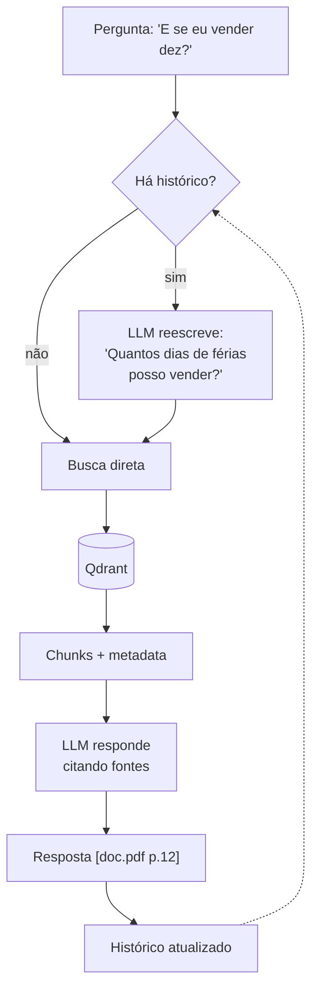

#### Criando

```bash
mkdir rag-02-conversacional-citacoes && cd rag-02-conversacional-citacoes
uv venv && source .venv/bin/activate
pip install langchain==1.3.14 langchain-openai==1.4.1 \
            langchain-text-splitters==1.1.2 langchain-qdrant==1.1.0 \
            langchain-community==0.4.2 pypdf==6.14.2 python-dotenv==1.2.2

docker compose up -d qdrant     # http://localhost:6333/dashboard
```

#### O núcleo — reescrita da pergunta

```python
from langchain_core.prompts import ChatPromptTemplate, MessagesPlaceholder
from langchain_core.output_parsers import StrOutputParser
from langchain_openai import ChatOpenAI

llm = ChatOpenAI(model="gpt-4o-mini", temperature=0)

# Este prompt NÃO responde nada. Ele só produz uma query de busca melhor.
# "não responda" e "devolva como está" são essenciais — sem eles o modelo
# tenta ser útil e responde a pergunta, quebrando a cadeia.
contextualize = ChatPromptTemplate.from_messages([
    ("system",
     "Dado o histórico da conversa e a última pergunta do usuário, "
     "reescreva a pergunta de forma que ela faça sentido SOZINHA, sem o histórico. "
     "Resolva pronomes e referências implícitas. "
     "NÃO responda a pergunta. Se ela já for autossuficiente, devolva-a como está."),
    MessagesPlaceholder("history"),
    ("human", "{question}"),
])

rewrite = contextualize | llm | StrOutputParser()

def search_query(inputs):
    if not inputs.get("history"):
        return inputs["question"]          # 1º turno: não gasta chamada
    return rewrite.invoke(inputs)
```

#### O núcleo — citação rastreável

```python
# A citação só é confiável se o identificador chegar ao modelo JUNTO do texto.
# Numerar as fontes e pedir a referência pelo número reduz muito a invenção
# de citações, porque o modelo copia um rótulo em vez de gerar um nome.
def format_with_sources(docs):
    return "\n\n".join(
        f"[{i}] (fonte: {d.metadata.get('source','?')}, "
        f"página {d.metadata.get('page','?')})\n{d.page_content}"
        for i, d in enumerate(docs, 1)
    )

answer_prompt = ChatPromptTemplate.from_messages([
    ("system",
     "Responda usando SOMENTE o contexto. Cite as fontes usadas no formato [1], [2] "
     "ao final de cada afirmação. Se o contexto não bastar, diga que não encontrou.\n\n"
     "Contexto:\n{context}"),
    MessagesPlaceholder("history"),
    ("human", "{question}"),
])
```

#### Corpus sugerido

Um documento com **regras que se referem umas às outras** — CLT, regulamento interno, contrato. É onde o follow-up ("e nesse caso?", "e se for o contrário?") aparece naturalmente.

#### Funcionou se…

- O diálogo de três turnos lá de cima funciona.
- Você imprime a query reescrita e vê a pergunta ambígua virar uma pergunta completa.
- Toda afirmação vem com `[n]`, e ao abrir a página citada o trecho **realmente está lá**. Cheque isso à mão umas cinco vezes — citação inventada é a alucinação mais perigosa, porque parece verificada.

#### Exercícios

1. **Meça o custo da reescrita.** Ela adiciona uma chamada de LLM por turno. Faça-a condicional: só reescreve se a pergunta tiver menos de N palavras ou contiver pronome.
2. **Janela de histórico.** Mande só os últimos 6 turnos. Conversa longa estoura contexto e piora a reescrita.
3. **Trocar Qdrant por Chroma** mudando só a linha do store. Sinta que a abstração `VectorStore` do LangChain torna o banco quase intercambiável — e que por isso a escolha do banco não é o que define a qualidade do seu RAG.

---

### Projeto 3 — `rag-03-hybrid-rerank`

> **Trilha Python · Dificuldade ▃ · Elasticsearch (Docker)**

#### O que você aprende

Busca híbrida (BM25 + densa) com fusão RRF, e **reranking** com cross-encoder. Este é o projeto com a melhor relação ganho/esforço de todos os dez.

#### Por que importa

Faça este teste no Projeto 1: pergunte sobre um código de erro específico — `E-4021`, `NF-e 8.2.1`, o nome de uma pessoa pouco comum. A busca densa vai falhar, e a falha é estrutural: embeddings capturam *significado*, e um código não tem significado semântico. `E-4021` e `E-4022` são quase o mesmo vetor.

BM25 (busca por palavra-chave, a mesma família do Lucene) acerta o token exato e erra o sinônimo. Densa acerta o sinônimo e erra o token. **Juntas cobrem os buracos uma da outra.**

Depois vem o reranking. A busca traz 20 candidatos rápido e barato; o cross-encoder lê a pergunta **junto** de cada candidato — não vetores separados — e reordena com precisão muito maior. Você passa 20 para ele e fica com os 4 melhores.

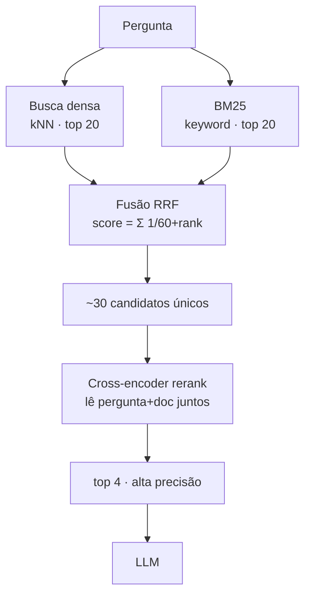

#### Criando

```bash
mkdir rag-03-hybrid-rerank && cd rag-03-hybrid-rerank
uv venv && source .venv/bin/activate
pip install langchain==1.3.14 langchain-openai==1.4.1 \
            langchain-elasticsearch==1.0.0 langchain-text-splitters==1.1.2 \
            langchain-community==0.4.2 rank-bm25==0.2.2 \
            sentence-transformers==5.6.1 python-dotenv==1.2.2

docker compose up -d elasticsearch
curl localhost:9200      # espere ~30 s até responder
```

> O `sentence-transformers` baixa ~500 MB de modelo (torch) na primeira execução. O reranker roda **local**, na CPU — não gasta API.

#### O núcleo — fusão RRF

```python
# Reciprocal Rank Fusion: combina rankings SEM precisar normalizar scores
# entre si. BM25 devolve algo como 14.7 e a busca densa 0.83 — grandezas
# incomparáveis. RRF ignora o valor e usa só a POSIÇÃO, o que o torna
# robusto e é por isso que virou o padrão de fato.
def reciprocal_rank_fusion(rankings: list[list], k: int = 60):
    scores, docs = {}, {}
    for ranking in rankings:
        for rank, doc in enumerate(ranking):
            key = doc.page_content[:200]          # chave de dedup
            scores[key] = scores.get(key, 0) + 1 / (k + rank + 1)
            docs[key] = doc
    ordered = sorted(scores.items(), key=lambda x: x[1], reverse=True)
    return [docs[key] for key, _ in ordered]

candidatos = reciprocal_rank_fusion([
    dense_retriever.invoke(pergunta),
    bm25_retriever.invoke(pergunta),
])
```

#### O núcleo — reranking

```python
from sentence_transformers import CrossEncoder

# Bi-encoder (a busca): embeda pergunta e doc SEPARADAMENTE, compara vetores.
#   Rápido, escala para milhões, menos preciso.
# Cross-encoder (este): processa pergunta e doc JUNTOS numa passada.
#   Lento, não escala, muito mais preciso.
# Daí o funil: bi-encoder pega 20 de 100k, cross-encoder escolhe 4 de 20.
reranker = CrossEncoder("cross-encoder/ms-marco-MiniLM-L-6-v2")

def rerank(pergunta, docs, top_n=4):
    scores = reranker.predict([(pergunta, d.page_content) for d in docs])
    ranked = sorted(zip(docs, scores), key=lambda x: x[1], reverse=True)
    return [d for d, _ in ranked[:top_n]]

finais = rerank(pergunta, candidatos[:20])
```

#### Corpus sugerido

Documentação técnica com **muitos identificadores**: manual de API com códigos de erro, catálogo de peças, tabela CID-10, tabela NCM. O objetivo é ter perguntas que a busca densa comprovadamente erra.

#### Funcionou se…

Monte uma tabelinha com 10 perguntas — 5 conceituais ("como funciona o cache?") e 5 de identificador ("o que é o erro E-4021?") — e rode nas três configurações:

| | Só densa | Híbrida | Híbrida + rerank |
|---|---|---|---|
| Conceituais (5) | | | |
| Identificadores (5) | | | |

A busca densa deve **falhar visivelmente** na linha de baixo, e a híbrida deve consertá-la. Se não falhar, seu corpus não tem identificadores raros o suficiente — troque o corpus, não o código. **Este é o entregável real do projeto:** a tabela, não o script.

#### Exercícios

1. Varie o `k` do RRF (padrão 60). Valor baixo dá muito peso ao 1º colocado; alto achata tudo.
2. Compare o cross-encoder local com a API de rerank da Cohere: qualidade vs. latência vs. custo.
3. Meça a latência de cada estágio. Rerankear 50 candidatos em vez de 20 melhora quanto, e custa quantos ms?

---

### Projeto 4 — `rag-04-multimodal-docs`

> **Trilha Python · Dificuldade ▅ · Chroma + docstore (multi-vector)**

#### O que você aprende

Extrair tabelas e imagens de PDFs complexos, e o padrão **multi-vector retriever**: indexar uma coisa, devolver outra.

#### Por que importa

Jogue no Projeto 1 um relatório financeiro ou um paper com gráficos. Metade da informação está em tabelas — que o `PyPDFLoader` transforma numa sopa de números sem cabeçalho — e a outra metade em imagens, que ele simplesmente ignora.

O truque central: uma tabela em texto bruto tem um embedding péssimo (é só número), mas o **resumo em linguagem natural** dela tem um embedding ótimo. Então você indexa o resumo e, quando ele for recuperado, entrega ao LLM a **tabela original inteira**. Você separa "o que busca bem" de "o que responde bem".

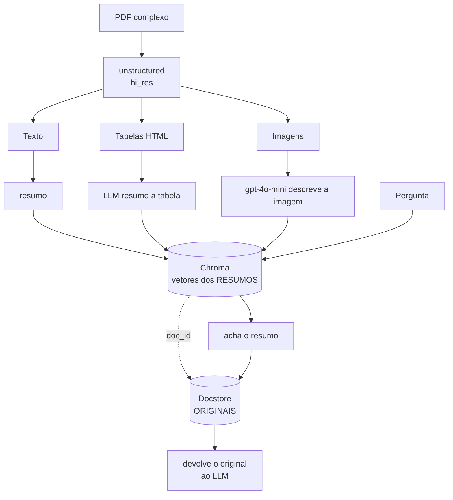

#### Criando

```bash
mkdir rag-04-multimodal-docs && cd rag-04-multimodal-docs
uv venv && source .venv/bin/activate
pip install langchain==1.3.14 langchain-openai==1.4.1 \
            langchain-chroma==1.1.0 langchain-community==0.4.2 \
            langchain-classic==1.0.8 unstructured[pdf]==0.24.1 \
            python-dotenv==1.2.2

sudo apt install -y poppler-utils tesseract-ocr tesseract-ocr-por
```

> ⚠️ Este é o setup mais chato dos dez. O `unstructured[pdf]` puxa dependências nativas pesadas (poppler, tesseract, detectron). Reserve tempo. `MultiVectorRetriever` está em `langchain-classic`.

#### O núcleo — particionar e resumir

```python
from unstructured.partition.pdf import partition_pdf

# hi_res usa modelo de layout para detectar tabelas e figuras de verdade,
# em vez de só varrer o texto. É lento (minutos por PDF) e vale a pena.
elements = partition_pdf(
    filename="docs/relatorio.pdf",
    strategy="hi_res",
    infer_table_structure=True,          # tabela → HTML com estrutura
    extract_images_in_pdf=True,
    extract_image_block_output_dir="./data/figures",
)

tabelas = [e for e in elements if e.category == "Table"]
textos  = [e for e in elements if e.category == "NarrativeText"]
```

```python
from langchain_core.prompts import ChatPromptTemplate
from langchain_openai import ChatOpenAI
from langchain_core.output_parsers import StrOutputParser

# O resumo é o que vai ser EMBEDADO. Ele precisa conter os termos que
# alguém usaria para procurar a tabela — por isso pedimos explicitamente
# as entidades e o período, não só "descreva".
resumir = (
    ChatPromptTemplate.from_template(
        "Resuma esta tabela para fins de busca semântica. Descreva o que ela "
        "contém, quais entidades, métricas e período aparecem. Seja específico "
        "com os nomes de coluna.\n\n{elemento}"
    )
    | ChatOpenAI(model="gpt-4o-mini")
    | StrOutputParser()
)

resumos_tabelas = resumir.batch(
    [{"elemento": t.metadata.text_as_html} for t in tabelas],
    {"max_concurrency": 5},
)
```

#### O núcleo — multi-vector retriever

```python
import uuid
from langchain_classic.retrievers.multi_vector import MultiVectorRetriever
from langchain_core.stores import InMemoryStore
from langchain_core.documents import Document

store  = InMemoryStore()                 # id → conteúdo ORIGINAL
vstore = Chroma(collection_name="multimodal",
                embedding_function=OpenAIEmbeddings(model="text-embedding-3-small"))

retriever = MultiVectorRetriever(vectorstore=vstore, docstore=store, id_key="doc_id")

ids = [str(uuid.uuid4()) for _ in tabelas]

# No vetorial vai o RESUMO...
retriever.vectorstore.add_documents([
    Document(page_content=resumo, metadata={"doc_id": i})
    for resumo, i in zip(resumos_tabelas, ids)
])
# ...no docstore vai o ORIGINAL. A busca casa com o resumo,
# o retorno entrega o HTML completo da tabela.
retriever.docstore.mset(list(zip(ids, [t.metadata.text_as_html for t in tabelas])))
```

Para imagens, o mesmo padrão: mande a figura para o `gpt-4o-mini` em modo visão (base64 numa mensagem `image_url`), guarde a descrição no vetorial e o caminho do arquivo no docstore.

#### Corpus sugerido

Relatório anual de empresa aberta, paper científico com gráficos, ou uma bula de medicamento. Precisa ter tabela **de verdade** — não texto alinhado com espaços.

#### Funcionou se…

Uma pergunta cuja resposta só existe numa célula de tabela ("qual foi a receita do 3º trimestre de 2024?") é respondida certo, e imprimindo o contexto você vê que chegou a **tabela em HTML**, não o resumo.

#### Exercícios

1. Troque o `InMemoryStore` por `LocalFileStore` (`from langchain_classic.storage import LocalFileStore`) — o `InMemoryStore` perde tudo ao fim do processo, o que torna a ingestão cara inutilizável.
2. Indexe **hipotéticas perguntas** em vez de resumos: peça ao LLM 3 perguntas que aquela tabela responde, e embede as perguntas. Frequentemente supera o resumo, porque aproxima o formato indexado do formato consultado.
3. Compare com o Projeto 1 no mesmo PDF. Quantas perguntas passam de errado para certo?

---

### Projeto 5 — `rag-05-agentic-corrective`

> **Trilha Python + LangGraph · Dificuldade ▆ · FAISS (in-process)**

#### O que você aprende

**LangGraph**: grafos de estado com ciclos. E o padrão **CRAG** (Corrective RAG) — o sistema julga a própria busca e se corrige.

#### Por que importa

Nos projetos 1–4 o pipeline é uma linha reta: busca → responde. Sempre. Se a busca traz lixo, o LLM responde com base em lixo.

Um humano não faz isso. Um humano olha o que achou, pensa "isso não responde a minha pergunta", e **busca de novo com outras palavras**. Fazer isso exige **ciclos** no fluxo, e é exatamente para isso que o LangGraph existe: você declara nós e arestas, e as arestas condicionais podem voltar.

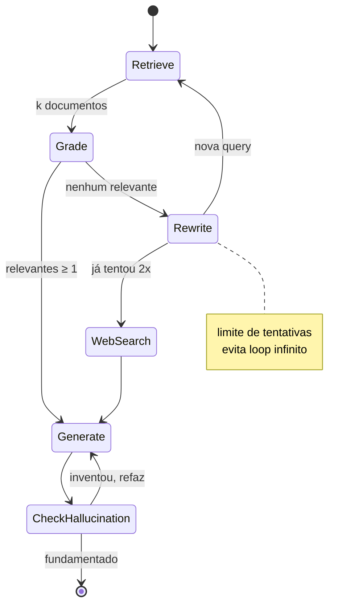

#### Criando

```bash
mkdir rag-05-agentic-corrective && cd rag-05-agentic-corrective
uv venv && source .venv/bin/activate
pip install langchain==1.3.14 langgraph==1.2.9 langchain-openai==1.4.1 \
            langchain-community==0.4.2 langchain-text-splitters==1.1.2 \
            faiss-cpu==1.14.3 langchain-tavily==0.2.18 python-dotenv==1.2.2
```

Chave gratuita de busca web em <https://tavily.com> → `TAVILY_API_KEY` no `.env`.

#### O núcleo — estado e avaliador

```python
from typing import TypedDict, Annotated
import operator

# O State é o contrato do grafo: cada nó recebe e devolve pedaços dele.
# Annotated[..., operator.add] faz o campo ACUMULAR entre nós em vez de
# sobrescrever — útil para logs e listas de documentos.
class GraphState(TypedDict):
    question: str
    original_question: str
    documents: list
    generation: str
    attempts: int
    steps: Annotated[list[str], operator.add]
```

```python
from pydantic import BaseModel, Field

# Saída estruturada força um booleano em vez de prosa. Sem isso o modelo
# responde "Bem, o documento parece parcialmente relevante..." e você
# acaba fazendo parsing de texto livre — frágil e caro.
class Grade(BaseModel):
    relevante: bool = Field(description="O documento ajuda a responder a pergunta?")
    motivo: str = Field(description="Justificativa em uma frase")

grader = ChatOpenAI(model="gpt-4o-mini", temperature=0).with_structured_output(Grade)

def grade_documents(state: GraphState):
    """Filtra: mantém só o que de fato ajuda."""
    mantidos = []
    for d in state["documents"]:
        r = grader.invoke(
            f"Pergunta: {state['question']}\n\nDocumento:\n{d.page_content}\n\n"
            "Este documento contém informação útil para responder? "
            "Seja rigoroso: relevância vaga não conta."
        )
        if r.relevante:
            mantidos.append(d)
    return {"documents": mantidos, "steps": [f"grade: {len(mantidos)} úteis"]}
```

#### O núcleo — o grafo com ciclo

```python
from langgraph.graph import StateGraph, START, END

def decidir(state: GraphState) -> str:
    """Aresta condicional: o retorno é o NOME do próximo nó."""
    if state["documents"]:
        return "generate"
    if state["attempts"] >= 2:
        return "web_search"        # desistiu do corpus local
    return "rewrite"               # ← este é o ciclo

g = StateGraph(GraphState)
g.add_node("retrieve",   retrieve)
g.add_node("grade",      grade_documents)
g.add_node("rewrite",    rewrite_query)
g.add_node("web_search", web_search)
g.add_node("generate",   generate)

g.add_edge(START, "retrieve")
g.add_edge("retrieve", "grade")
g.add_conditional_edges("grade", decidir,
                        {"generate": "generate",
                         "rewrite": "rewrite",
                         "web_search": "web_search"})
g.add_edge("rewrite", "retrieve")      # volta — o ciclo fecha aqui
g.add_edge("web_search", "generate")
g.add_edge("generate", END)

app = g.compile()

# stream() mostra cada nó executando — a melhor forma de aprender LangGraph
for evento in app.stream({"question": pergunta, "attempts": 0}):
    print(evento)
```

> 🎓 **O `attempts >= 2` não é detalhe de implementação, é a lição.** Todo grafo com ciclo precisa de uma condição de saída explícita. Sem ela o agente reescreve a pergunta para sempre e você descobre o problema na fatura da OpenAI.

#### Corpus sugerido

Um corpus **deliberadamente incompleto**: indexe documentação de um assunto e faça perguntas sobre um assunto vizinho que não está lá. É assim que você vê o fallback disparar.

#### Funcionou se…

- Uma pergunta bem coberta pelo corpus vai direto: `retrieve → grade → generate`.
- Uma pergunta mal coberta faz o caminho longo: `retrieve → grade → rewrite → retrieve → grade → web_search → generate`.
- O `stream()` mostra os dois caminhos claramente.

#### Exercícios

1. Adicione o nó `check_hallucination` do diagrama: um avaliador que compara a resposta com os documentos e devolve ao `generate` se ela afirmar algo que não está lá (máximo 2 vezes).
2. Adicione **checkpointer** (`MemorySaver`) para o grafo ficar retomável e ganhar memória entre execuções.
3. Meça o custo: quantas chamadas de LLM um caminho longo gasta contra o Projeto 1? Grade em 5 documentos = 5 chamadas. Vale sempre? Faça o grading só se o melhor score de similaridade for baixo.

---

### Projeto 6 — `rag-06-router-sql-multifonte`

> **Trilha Python + LangGraph · Dificuldade ▇ · pgvector + SQLite**

#### O que você aprende

Roteamento entre fontes heterogêneas e **Text-to-SQL**: transformar pergunta em consulta SQL, executar, e usar o resultado como contexto.

#### Por que importa

Nem toda resposta está num documento. "Quantos pedidos foram cancelados em março?" não está escrita em lugar nenhum — ela precisa ser **calculada**. Nenhum vector store responde isso, porque a informação não existe como texto: existe como agregação.

Um assistente real tem que decidir: isso é pergunta de documento, de banco de dados, ou de web? Este projeto constrói esse roteador.

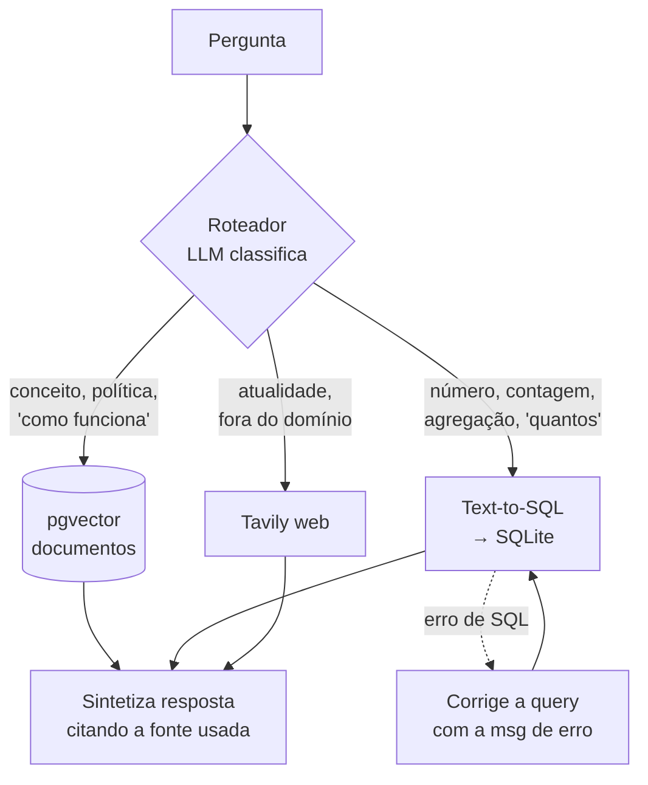

#### Criando

```bash
mkdir rag-06-router-sql-multifonte && cd rag-06-router-sql-multifonte
uv venv && source .venv/bin/activate
pip install langchain==1.3.14 langgraph==1.2.9 langchain-openai==1.4.1 \
            langchain-postgres==0.0.17 langchain-community==0.4.2 \
            langchain-tavily==0.2.18 psycopg[binary] python-dotenv==1.2.2

docker compose up -d postgres
```

#### O núcleo — roteador

```python
from typing import Literal
from pydantic import BaseModel, Field

class Rota(BaseModel):
    destino: Literal["documentos", "banco", "web"] = Field(
        description="Onde buscar a resposta"
    )
    justificativa: str

# A qualidade do roteador é 90% a qualidade DESTE prompt. Exemplos concretos
# valem mais que descrições abstratas — o modelo generaliza a partir deles.
roteador = ChatOpenAI(model="gpt-4o-mini", temperature=0).with_structured_output(Rota)

ROUTER_PROMPT = """Classifique a pergunta do usuário.

- "documentos": políticas, conceitos, procedimentos, regras. Texto escrito.
  Ex: "qual a política de reembolso?", "como funciona o processo de compra?"

- "banco": números, contagens, somas, rankings, filtros por data.
  Tabelas disponíveis: pedidos(id, cliente_id, valor, status, criado_em),
                       clientes(id, nome, cidade, criado_em)
  Ex: "quantos pedidos cancelados em março?", "qual cliente comprou mais?"

- "web": eventos atuais ou assuntos fora do domínio da empresa.
  Ex: "qual a cotação do dólar hoje?"

Pergunta: {question}"""
```

#### O núcleo — Text-to-SQL com autocorreção

```python
from langchain_community.utilities import SQLDatabase

db = SQLDatabase.from_uri("sqlite:///data/vendas.db")

def text_to_sql(state):
    # db.get_table_info() devolve o DDL + linhas de exemplo. É o que dá ao
    # modelo o vocabulário exato de colunas e valores. Sem isso ele inventa
    # nomes de coluna que parecem certos.
    prompt = f"""Dado o schema abaixo, escreva UMA consulta SQLite que responda a pergunta.
Devolva apenas o SQL, sem markdown, sem explicação.
Nunca use INSERT, UPDATE, DELETE ou DROP.

{db.get_table_info()}

Pergunta: {state['question']}
SQL:"""
    sql = llm.invoke(prompt).content.strip().strip("`").removeprefix("sql").strip()

    # Autocorreção: o erro do banco é o melhor feedback possível — ele diz
    # exatamente o que está errado, em linguagem que o modelo entende.
    for tentativa in range(2):
        try:
            resultado = db.run(sql)
            return {"sql": sql, "resultado": resultado}
        except Exception as e:
            sql = llm.invoke(
                f"Este SQL falhou:\n{sql}\n\nErro: {e}\n\n"
                f"Schema:\n{db.get_table_info()}\n\nCorrija. Devolva só o SQL."
            ).content.strip().strip("`").removeprefix("sql").strip()

    return {"erro": "não consegui montar a consulta"}
```

> 🔒 **Segurança.** Text-to-SQL executa código gerado por LLM no seu banco. Em qualquer coisa além de estudo: **usuário read-only no banco** (a garantia real), timeout na query, allowlist de tabelas. O "nunca use DELETE" no prompt é uma sugestão a um modelo probabilístico, não um controle de segurança — trate-o como tal.

#### Corpus sugerido

Um SQLite com 2–3 tabelas e uns milhares de linhas fictícias (peça ao próprio Claude para gerar o script de seed) **mais** um punhado de documentos de política que combinem com esses dados. A graça está em ter perguntas dos dois tipos sobre o mesmo domínio.

#### Funcionou se…

Três perguntas seguidas vão para três destinos diferentes, e o log mostra a decisão:

| Pergunta | Rota esperada |
|---|---|
| "Qual a política de cancelamento?" | `documentos` |
| "Quantos pedidos foram cancelados em março?" | `banco` |
| "Qual a cotação do dólar hoje?" | `web` |

#### Exercícios

1. **Rota híbrida.** "Quantos pedidos foram cancelados em março e o que diz a política sobre isso?" precisa das duas fontes. Faça o roteador devolver uma lista, e execute em paralelo com `Send` do LangGraph.
2. **Few-shot dinâmico.** Guarde pares (pergunta, SQL correto) num vector store e injete os 3 mais parecidos no prompt de Text-to-SQL. Ganho grande e barato.
3. Faça o roteador registrar a confiança e cair para `documentos` quando estiver abaixo de um limiar.

---

### Projeto 7 — `rag-07-graphrag-neo4j`

> **Trilha Python · Dificuldade █ · Neo4j (Docker)**

#### O que você aprende

Extrair um **grafo de conhecimento** de texto não estruturado e consultar grafo + vetor juntos.

#### Por que importa

Existe uma classe de pergunta que **nenhum** dos projetos anteriores responde. Considere:

> "Quais projetos são liderados por alguém que já trabalhou com a Maria?"

Isso exige: achar Maria → achar quem trabalhou com ela → achar os projetos dessas pessoas → filtrar por liderança. Três saltos. A informação está espalhada em documentos que **nunca aparecem juntos** — nenhum chunk contém a resposta, então nenhuma busca por similaridade pode encontrá-la. Não é um problema de qualidade de busca; é um problema de **forma do dado**.

Grafos resolvem isso porque relação é cidadã de primeira classe: `(Maria)-[:TRABALHOU_COM]->(João)-[:LIDERA]->(Projeto X)` é uma travessia, não uma busca.

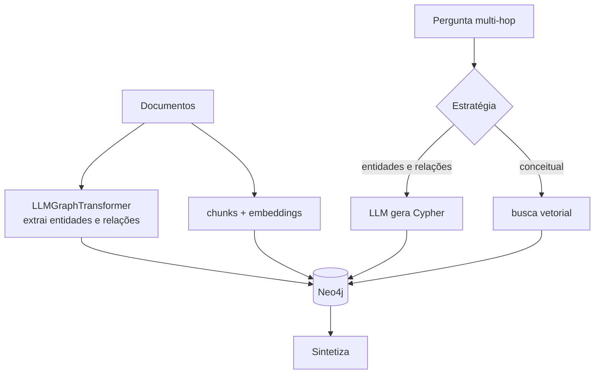

#### Criando

```bash
mkdir rag-07-graphrag-neo4j && cd rag-07-graphrag-neo4j
uv venv && source .venv/bin/activate
pip install langchain==1.3.14 langchain-openai==1.4.1 \
            langchain-neo4j==0.10.0 langchain-text-splitters==1.1.2 \
            langchain-community==0.4.2 python-dotenv==1.2.2

docker compose up -d neo4j     # http://localhost:7474 · neo4j / senha12345
```

#### O núcleo — extração do grafo

```python
from langchain_neo4j import LLMGraphTransformer, Neo4jGraph

graph = Neo4jGraph(url="bolt://localhost:7687", username="neo4j", password="senha12345")

# Restringir os tipos é o que separa um grafo útil de um emaranhado.
# Sem allowed_nodes o LLM cria dezenas de tipos quase-duplicados
# ("Empresa", "Organização", "Companhia") e nada conecta com nada.
transformer = LLMGraphTransformer(
    llm=ChatOpenAI(model="gpt-4o-mini", temperature=0),
    allowed_nodes=["Pessoa", "Empresa", "Projeto", "Tecnologia", "Local"],
    allowed_relationships=["TRABALHOU_EM", "LIDERA", "USA", "LOCALIZADO_EM",
                           "PARCEIRO_DE", "TRABALHOU_COM"],
    node_properties=["descricao", "data_inicio"],
)

graph_docs = transformer.convert_to_graph_documents(chunks)
graph.add_graph_documents(graph_docs, baseEntityLabel=True, include_source=True)
```

> ⏱️ **É a ingestão mais cara dos dez projetos** — uma chamada de LLM por chunk, cada uma com saída longa. Comece com 20–30 chunks. Depois de indexar, **abra o Neo4j Browser e rode `MATCH (n) RETURN n LIMIT 50`**. Ver o grafo desenhado é o momento em que GraphRAG faz sentido.

#### O núcleo — pergunta em linguagem natural → Cypher

```python
from langchain_neo4j import GraphCypherQAChain

chain = GraphCypherQAChain.from_llm(
    llm=ChatOpenAI(model="gpt-4o-mini", temperature=0),
    graph=graph,
    verbose=True,             # mostra o Cypher gerado — deixe ligado, é o aprendizado
    allow_dangerous_requests=True,   # ver aviso abaixo
    top_k=10,
)

chain.invoke({"query": "Quais projetos são liderados por quem já trabalhou com a Maria?"})
```

> 🔒 `allow_dangerous_requests=True` existe porque a chain executa Cypher gerado por LLM. Mesmo raciocínio do Projeto 6: em produção, **usuário Neo4j read-only**. A flag é um lembrete, não uma proteção.

O Cypher gerado deve sair parecido com:

```cypher
MATCH (m:Pessoa {id: "Maria"})-[:TRABALHOU_COM]-(colega:Pessoa)-[:LIDERA]->(p:Projeto)
RETURN p.id, colega.id
```

#### Corpus sugerido

Texto **denso em entidades e relações**: notícias sobre um setor, biografias, atas de reunião, wiki de projeto. Documentação técnica funciona mal aqui — tem poucos atores e poucas relações entre eles.

#### Funcionou se…

Uma pergunta multi-hop de 2–3 saltos é respondida corretamente **e** você consegue verificar o Cypher no log e reproduzi-lo à mão no Neo4j Browser. Depois faça a mesma pergunta no Projeto 1 sobre o mesmo corpus — o contraste é o resultado do projeto.

#### Exercícios

1. **Híbrido de verdade.** Rode busca vetorial e Cypher **em paralelo** e mande as duas evidências ao sintetizador. Grafo acerta relação, vetor acerta nuance; juntos cobrem mais.
2. **Resolução de entidades.** "Maria", "Maria Silva" e "M. Silva" viram três nós. Faça um passo de merge por similaridade de nome + embedding antes de gravar. É o problema mais real de GraphRAG.
3. Implemente detecção de comunidades (Louvain, via plugin GDS) e resuma cada comunidade — a base do "global search" do GraphRAG da Microsoft, que responde perguntas sobre o corpus *inteiro*.

---

### Projeto 8 — `rag-08-springai-qa-docs`

> **Trilha Java · Dificuldade ▂ · PGVector (Docker)**

#### O que você aprende

O pipeline de RAG em Spring AI: `DocumentReader` → `TextSplitter` → `VectorStore` → `QuestionAnswerAdvisor`, exposto numa API REST com streaming.

#### Por que importa

Spring AI segue a filosofia do Spring: convenção, injeção de dependência e auto-configuração. Você declara o `VectorStore` no `application.yml` e recebe um bean pronto. E o conceito central que não existe no LangChain — **Advisor**: um interceptador na cadeia da chamada ao LLM. O `QuestionAnswerAdvisor` faz todo o RAG (busca + montagem do prompt) em uma linha de configuração.

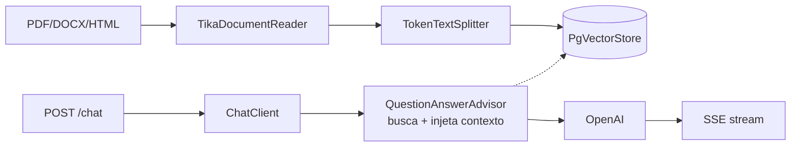

#### Criando

Use o [start.spring.io](https://start.spring.io) ou a CLI:

```bash
# TRILHO A (padrão) — Spring Boot 4.1 + Spring AI 2.0, no seu Java 17
spring init --boot-version=4.1.0 --java-version=17 --type=maven-project \
  --dependencies=web,spring-ai-openai,spring-ai-vectordb-pgvector \
  --group-id=dev.rag --artifact-id=rag-08-springai-qa-docs \
  rag-08-springai-qa-docs
```

Os IDs de dependência acima foram conferidos contra os metadados do Initializr. Outros úteis: `spring-ai-vectordb-redis`, `spring-ai-vectordb-qdrant`, `spring-ai-vectordb-neo4j`, `spring-ai-mcp-server`, `spring-ai-tika-document-reader`, `spring-ai-ollama`, `actuator`.

Para o **Trilho B**, gere igual e depois rebaixe o `<parent>` e o BOM à mão — o Initializr não oferece mais Boot 3.5.

#### Dependências — a diferença entre os trilhos

```xml
<!-- ═══ TRILHO A · padrão · Java 17 ═══ -->
<parent>
    <groupId>org.springframework.boot</groupId>
    <artifactId>spring-boot-starter-parent</artifactId>
    <version>4.1.0</version>
</parent>
<properties><java.version>17</java.version></properties>
<dependencyManagement><dependencies><dependency>
    <groupId>org.springframework.ai</groupId>
    <artifactId>spring-ai-bom</artifactId>
    <version>2.0.0</version>
    <type>pom</type><scope>import</scope>
</dependency></dependencies></dependencyManagement>
<dependencies>
    <dependency>
        <groupId>org.springframework.ai</groupId>
        <artifactId>spring-ai-vector-store-advisor</artifactId>    <!-- ⚠️ nome 2.0 -->
    </dependency>
    ...
</dependencies>
```

```xml
<!-- ═══ TRILHO B · legado · Java 17 ═══ -->
<parent>
    <groupId>org.springframework.boot</groupId>
    <artifactId>spring-boot-starter-parent</artifactId>
    <version>3.5.16</version>
</parent>
<properties><java.version>17</java.version></properties>
<dependencyManagement><dependencies><dependency>
    <groupId>org.springframework.ai</groupId>
    <artifactId>spring-ai-bom</artifactId>
    <version>1.1.8</version>
    <type>pom</type><scope>import</scope>
</dependency></dependencies></dependencyManagement>
<dependencies>
    <dependency>
        <groupId>org.springframework.ai</groupId>
        <artifactId>spring-ai-advisors-vector-store</artifactId>   <!-- ⚠️ nome 1.1.x -->
    </dependency>
    ...
</dependencies>
```

**Comuns aos dois trilhos** (o BOM cuida da versão):

```xml
<dependency>
    <groupId>org.springframework.ai</groupId>
    <artifactId>spring-ai-starter-model-openai</artifactId>
</dependency>
<dependency>
    <groupId>org.springframework.ai</groupId>
    <artifactId>spring-ai-starter-vector-store-pgvector</artifactId>
</dependency>
<dependency>
    <groupId>org.springframework.ai</groupId>
    <artifactId>spring-ai-tika-document-reader</artifactId>
</dependency>
```

> 📌 A diferença **em código** entre os trilhos, neste projeto, é **zero**. `ChatClient` e `QuestionAnswerAdvisor` têm a mesma API nos dois — conferido classe a classe nos JARs das duas versões. Só o `pom.xml` muda.

#### `application.yml`

```yaml
spring:
  ai:
    openai:
      api-key: ${OPENAI_API_KEY}
      chat.options:
        model: gpt-4o-mini
        temperature: 0.0
      embedding.options:
        model: text-embedding-3-small
    vectorstore:
      pgvector:
        initialize-schema: true      # cria a tabela e o índice sozinho
        dimensions: 1536             # ⚠️ tem que bater com o modelo de embedding
        index-type: hnsw
        distance-type: cosine_distance
  datasource:
    url: jdbc:postgresql://localhost:5432/ragdb
    username: rag
    password: rag
```

#### O núcleo — ingestão

```java
@Service
public class IngestionService {

    private final VectorStore vectorStore;

    public IngestionService(VectorStore vectorStore) {   // injetado pelo starter
        this.vectorStore = vectorStore;
    }

    public int ingest(Resource file) {
        // Tika lê PDF, DOCX, HTML, PPTX... com um único reader.
        var reader = new TikaDocumentReader(file);
        List<Document> documents = reader.get();

        // TokenTextSplitter conta TOKENS, não caracteres — mais fiel ao
        // limite real do modelo que o split por caractere do Projeto 1.
        // Use o builder: os construtores públicos são só o vazio, o (boolean)
        // e um de 6 argumentos posicionais que ninguém lembra a ordem.
        var splitter = TokenTextSplitter.builder()
                .withChunkSize(800)             // tokens por chunk
                .withMinChunkSizeChars(350)
                .withMinChunkLengthToEmbed(5)   // descarta fragmentos inúteis
                .withMaxNumChunks(10000)
                .withKeepSeparator(true)
                .build();
        List<Document> chunks = splitter.apply(documents);

        vectorStore.add(chunks);   // embeda e persiste numa chamada
        return chunks.size();
    }
}
```

#### O núcleo — QuestionAnswerAdvisor + streaming

```java
@RestController
public class ChatController {

    private final ChatClient chatClient;

    public ChatController(ChatClient.Builder builder, VectorStore vectorStore) {
        this.chatClient = builder
                .defaultSystem("""
                    Responda usando SOMENTE o contexto fornecido.
                    Se o contexto não contiver a resposta, diga que não encontrou
                    a informação nos documentos. Nunca invente.""")
                // O advisor intercepta TODA chamada: busca no vector store e
                // injeta os documentos no prompt automaticamente. É o
                // equivalente Spring de toda a LCEL do Projeto 1.
                .defaultAdvisors(QuestionAnswerAdvisor.builder(vectorStore)
                        .searchRequest(SearchRequest.builder()
                                .topK(4)
                                .similarityThreshold(0.5)   // corta match fraco
                                .build())
                        .build())
                .build();
    }

    @PostMapping("/chat")
    public String chat(@RequestBody String question) {
        return chatClient.prompt().user(question).call().content();
    }

    // Streaming token a token — o usuário vê a resposta se formando.
    @PostMapping(value = "/chat/stream", produces = MediaType.TEXT_EVENT_STREAM_VALUE)
    public Flux<String> stream(@RequestBody String question) {
        return chatClient.prompt().user(question).stream().content();
    }
}
```

```bash
docker compose up -d postgres
export OPENAI_API_KEY=sk-...
mvn spring-boot:run

curl -X POST localhost:8080/ingest -F "file=@docs/manual.pdf"
curl -N -X POST localhost:8080/chat/stream -d "qual o prazo de garantia?"
```

#### Funcionou se…

`curl -N` mostra a resposta chegando aos pedaços, e no Postgres:

```sql
SELECT count(*) FROM vector_store;
SELECT content, metadata FROM vector_store LIMIT 3;
```

mostra os chunks com os embeddings.

#### Exercícios

1. Compare com o Projeto 1: mesmo PDF, mesma pergunta. Onde o Spring AI economiza código? Onde ele esconde algo que você gostaria de controlar?
2. Adicione filtro por metadado (`FilterExpressionBuilder`) para restringir a busca a um documento.
3. Habilite `spring-boot-starter-actuator` e veja as métricas de token em `/actuator/metrics`.

---

### Projeto 9 — `rag-09-springai-rag-modular`

> **Trilha Java · Dificuldade ▅ · Redis Stack (Docker)**

#### O que você aprende

O **Modular RAG** do Spring AI: `RetrievalAugmentationAdvisor` com pré-retrieval, retrieval e pós-retrieval customizáveis — mais memória de conversa persistente.

#### Por que importa

O `QuestionAnswerAdvisor` do Projeto 8 é uma caixa preta: busca e injeta, ponto final. Não dá para reescrever a query (Projeto 2), expandir em múltiplas variantes, nem rerankear (Projeto 3).

O `RetrievalAugmentationAdvisor` abre a caixa. Cada estágio do pipeline vira um componente que você troca — é a resposta do Spring AI ao mesmo problema que o LangGraph resolve com grafos, só que declarativa em vez de imperativa.

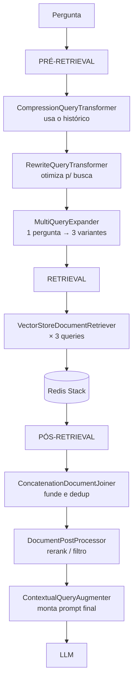

#### Criando

Mesma base do Projeto 8, trocando o vector store e somando o `spring-ai-rag`:

```xml
<dependency>
    <groupId>org.springframework.ai</groupId>
    <artifactId>spring-ai-starter-vector-store-redis</artifactId>
</dependency>
<dependency>
    <groupId>org.springframework.ai</groupId>
    <artifactId>spring-ai-rag</artifactId>     <!-- existe em 1.1.8 E em 2.0.0 -->
</dependency>
```

```yaml
spring:
  ai:
    vectorstore:
      redis:
        initialize-schema: true
        index-name: rag-index
        prefix: "doc:"
  data:
    redis:
      host: localhost
      port: 6379
```

```bash
docker compose up -d redis     # RedisInsight em http://localhost:8001
```

#### O núcleo — o pipeline modular

```java
@Bean
public ChatClient ragChatClient(ChatClient.Builder builder,
                                VectorStore vectorStore,
                                ChatModel chatModel) {

    var advisor = RetrievalAugmentationAdvisor.builder()

        // ── PRÉ-RETRIEVAL ──────────────────────────────────────────
        // Compression = o equivalente Spring do "history-aware retriever"
        // do Projeto 2: usa o histórico para tornar a pergunta autossuficiente.
        .queryTransformers(
            CompressionQueryTransformer.builder()
                .chatClientBuilder(ChatClient.builder(chatModel))
                .build(),
            RewriteQueryTransformer.builder()
                .chatClientBuilder(ChatClient.builder(chatModel))
                .targetSearchSystem("vector store")
                .build()
        )
        // Uma pergunta vira N formulações diferentes. Cada uma busca por
        // conta própria; a união cobre mais que qualquer uma sozinha.
        // Custo: N× a busca + 1 chamada de LLM.
        .queryExpander(
            MultiQueryExpander.builder()
                .chatClientBuilder(ChatClient.builder(chatModel))
                .numberOfQueries(3)
                .build()
        )

        // ── RETRIEVAL ──────────────────────────────────────────────
        .documentRetriever(
            VectorStoreDocumentRetriever.builder()
                .vectorStore(vectorStore)
                .topK(5)
                .similarityThreshold(0.5)
                .build()
        )

        // ── PÓS-RETRIEVAL ──────────────────────────────────────────
        // Funde os resultados das 3 queries e remove duplicatas.
        .documentJoiner(new ConcatenationDocumentJoiner())

        // ⭐ O anti-alucinação: com allowEmptyContext(false), se nada
        // relevante for recuperado o advisor NÃO chama o LLM com contexto
        // vazio — ele devolve a mensagem abaixo. É a diferença entre
        // "não sei" e uma resposta inventada com confiança.
        .queryAugmenter(
            ContextualQueryAugmenter.builder()
                .allowEmptyContext(false)
                .emptyContextPromptTemplate(new PromptTemplate(
                    "Não encontrei informação sobre isso nos documentos indexados."))
                .build()
        )
        .build();

    return builder
        .defaultAdvisors(
            MessageChatMemoryAdvisor.builder(chatMemory()).build(),  // memória
            advisor                                                  // RAG
        )
        .build();
}
```

> ⚠️ **A ordem dos advisors importa.** A memória precisa vir antes do RAG, porque o `CompressionQueryTransformer` depende do histórico já estar no contexto para conseguir comprimir a pergunta.

#### Funcionou se…

- Ligue `logging.level.org.springframework.ai=DEBUG` e veja as **3 queries expandidas** nos logs. É a evidência de que o pipeline modular está rodando de verdade.
- Uma pergunta totalmente fora do corpus retorna exatamente a mensagem de contexto vazio — não uma resposta inventada.
- O RedisInsight (`localhost:8001`) mostra as chaves `doc:*` com os vetores.

#### Exercícios

1. Implemente um `DocumentPostProcessor` que rerankeia — a versão Java do Projeto 3. Chame um serviço de rerank ou ordene por um segundo critério.
2. Troque `ChatMemory` de in-memory para persistente (JDBC), e veja a conversa sobreviver ao restart.
3. **Meça o custo do modular.** Com `MultiQueryExpander(3)` você faz 1 chamada extra de LLM + 3 buscas por pergunta. Compare a qualidade contra o Projeto 8 e decida se compensa no seu corpus. Nem sempre compensa — e saber medir isso é o objetivo.

---

### Projeto 10 — `rag-10-springai-agente-mcp`

> **Trilha Java · Dificuldade █ · Qdrant (Docker) · Trilho A (Spring AI 2.0)**

#### O que você aprende

RAG agêntico em Java (tool calling), exposição do seu corpus como **servidor MCP**, e observabilidade de produção.

#### Por que importa

Nos projetos 8 e 9 a busca é **obrigatória**: todo prompt passa pelo advisor, mesmo um "bom dia". Aqui o RAG vira uma **ferramenta que o modelo escolhe usar** — ele decide se precisa buscar, o que buscar, e pode buscar várias vezes em sequência. É o análogo Java do Projeto 5, mas via tool calling em vez de grafo explícito.

E o MCP (Model Context Protocol) inverte a relação: em vez do seu app consumir o LLM, você **publica seu corpus como servidor** e qualquer cliente MCP — Claude Code, Claude Desktop, outro agente — consulta seus documentos.

> 🎯 **Este projeto exige o Trilho A (Spring AI 2.0).** Nos projetos 8 e 9 os trilhos eram intercambiáveis; aqui eles divergem de verdade. O 2.0 tirou o loop de tool calling de dentro de cada `ChatModel` e o promoveu a `ToolCallingAdvisor` na cadeia de advisors — o que permite compor, interceptar e observar o loop. E o MCP Java SDK 2.0 traz o modelo por anotações (`@McpTool`), bem mais limpo que o registro manual do 1.1.x. Continua rodando no seu **Java 17**.

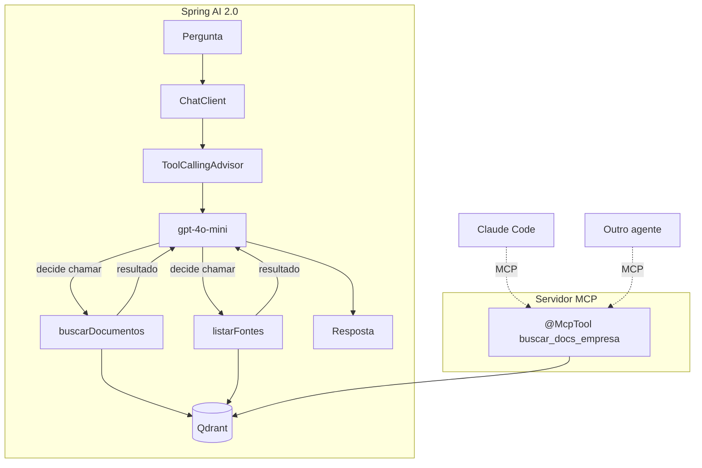

#### Criando

```bash
spring init --boot-version=4.1.0 --java-version=17 --type=maven-project \
  --dependencies=web,actuator,spring-ai-openai,spring-ai-vectordb-qdrant,spring-ai-mcp-server \
  --group-id=dev.rag --artifact-id=rag-10-springai-agente-mcp \
  rag-10-springai-agente-mcp

docker compose up -d qdrant
```

```xml
<dependency>
    <groupId>org.springframework.ai</groupId>
    <artifactId>spring-ai-starter-mcp-server-webmvc</artifactId>
</dependency>
<dependency>
    <groupId>io.micrometer</groupId>
    <artifactId>micrometer-registry-prometheus</artifactId>
</dependency>
```

#### O núcleo — RAG como ferramenta

```java
@Component
public class DocumentTools {

    private final VectorStore vectorStore;

    public DocumentTools(VectorStore vectorStore) { this.vectorStore = vectorStore; }

    // A @Tool description NÃO é documentação: é o prompt que o modelo lê para
    // decidir se chama esta função. Escreva-a para o modelo, não para o dev.
    // Diga QUANDO usar, não só o que faz.
    @Tool(description = """
        Busca trechos relevantes na base de documentos internos da empresa.
        Use SEMPRE que a pergunta envolver políticas, procedimentos, produtos
        ou qualquer informação específica da organização.
        Pode ser chamada várias vezes com termos diferentes se a primeira
        busca não trouxer o suficiente.""")
    public String buscarDocumentos(
            @ToolParam(description = "Termos de busca. Use palavras que apareceriam "
                                   + "no documento, não a pergunta literal do usuário.")
            String consulta,
            @ToolParam(description = "Quantos trechos retornar, entre 1 e 10")
            int quantidade) {

        var docs = vectorStore.similaritySearch(
                SearchRequest.builder()
                        .query(consulta)
                        .topK(Math.max(1, Math.min(10, quantidade)))   // Math.clamp é Java 21+
                        .build());

        if (docs.isEmpty()) {
            // Retorno acionável: diz ao modelo o que fazer em seguida,
            // em vez de devolver vazio e deixá-lo travado.
            return "Nenhum documento encontrado. Tente outros termos de busca.";
        }

        return docs.stream()
                .map(d -> "[%s] %s".formatted(
                        d.getMetadata().getOrDefault("source", "?"),
                        d.getText()))
                .collect(Collectors.joining("\n\n---\n\n"));
    }
}
```

```java
@Bean
public ChatClient agentClient(ChatClient.Builder builder, DocumentTools tools) {
    return builder
        .defaultSystem("""
            Você é um assistente da empresa.
            Antes de responder qualquer pergunta sobre a organização, USE a
            ferramenta buscarDocumentos. Se a primeira busca não bastar, busque
            de novo com outros termos antes de desistir.
            Responda apenas com base no que as ferramentas retornarem e cite a fonte.
            Se não encontrar, diga que não encontrou.""")
        // No Spring AI 2.0 o loop de tool calling é um advisor na cadeia —
        // dá para interceptar, limitar e observar cada rodada.
        .defaultTools(tools)
        .build();
}
```

#### O núcleo — servidor MCP

```java
@Service
public class RagMcpServer {

    private final VectorStore vectorStore;

    public RagMcpServer(VectorStore vectorStore) { this.vectorStore = vectorStore; }

    // Expõe a busca para QUALQUER cliente MCP — Claude Code, Claude Desktop,
    // outro agente. Seu corpus vira infraestrutura compartilhada.
    @McpTool(name = "buscar_docs_empresa",
             description = "Busca na base de documentos internos da empresa")
    public String buscar(
            @McpToolParam(description = "Termos de busca") String consulta) {
        return vectorStore.similaritySearch(consulta).stream()
                .map(Document::getText)
                .collect(Collectors.joining("\n---\n"));
    }
}
```

```yaml
spring:
  ai:
    mcp:
      server:
        name: rag-docs-empresa
        version: 1.0.0
management:
  endpoints.web.exposure.include: health,metrics,prometheus
  metrics.tags.application: rag-10
```

Registre no Claude Code:

```bash
claude mcp add --transport http rag-empresa http://localhost:8080/mcp
```

#### Funcionou se…

1. **Tool calling seletivo.** "Bom dia" → resposta direta, **sem** chamar ferramenta. "Qual a política de home office?" → chama `buscarDocumentos`. Isso é o ponto do projeto: no Projeto 8 as duas passariam pela busca.
2. **Multi-hop.** Uma pergunta que exige duas buscas (ex.: "compare a política de férias com a de licença") dispara duas chamadas com termos diferentes. Veja nos logs.
3. **MCP externo.** Depois do `claude mcp add`, pergunte ao Claude Code algo que só está no seu corpus e veja a ferramenta ser chamada de fora do seu app.
4. **Métricas.** `curl localhost:8080/actuator/metrics/gen_ai.client.operation` mostra chamadas, latência e tokens.

#### Exercícios

1. **Guardrail de custo.** Um advisor que limita a 5 rodadas de tool calling por pergunta e corta a conversa com uma mensagem clara.
2. **Ferramentas de escrita.** Adicione `indexarDocumento` para o agente ingerir novo conteúdo — e pense no controle de acesso que isso passa a exigir.
3. **`StructuredOutputValidationAdvisor`** (novo no 2.0): force a resposta a um record Java com validação e retentativa automática quando o JSON não bater.
4. Exporte para Prometheus + Grafana e monte um painel de tokens/minuto e latência p95.

---

## Apêndice A — Avaliação com RAGAS

> Aplicável a qualquer um dos 10 projetos. Faça isso a partir do Projeto 3 — é o que transforma "achismo" em engenharia.

Sem medição, todo ajuste vira chute. Você muda o `chunk_size`, testa três perguntas, acha que melhorou, e não faz ideia se piorou em vinte outras.

```bash
pip install ragas==0.4.3
```

### O golden dataset

30–50 perguntas sobre o seu corpus, escritas **à mão**, com a resposta esperada e o trecho de origem. É trabalhoso e é o ativo mais valioso do projeto — vale mais que qualquer linha de código, porque é o que permite comparar qualquer configuração futura.

```python
golden = [
    {"question": "Qual o prazo de garantia?",
     "ground_truth": "12 meses a partir da emissão da nota fiscal.",
     "source": "manual.pdf p.14"},
    ...
]
```

Inclua de propósito **perguntas sem resposta no corpus**. A métrica mais ignorada de todas é: com que frequência o sistema diz "não sei" quando deveria?

### As quatro métricas

| Métrica | Pergunta que responde | Se estiver baixa |
|---|---|---|
| **Faithfulness** | A resposta se apoia nos documentos recuperados? | O gerador aluciná — ajuste o prompt, baixe a temperatura |
| **Answer relevancy** | A resposta responde a pergunta feita? | O gerador divaga ou responde outra coisa |
| **Context precision** | Os documentos trazidos são relevantes? | Excesso de ruído — reduza `top_k`, adicione rerank |
| **Context recall** | O que era necessário foi trazido? | A busca está perdendo coisa — chunking, híbrida, `top_k` maior |

**Diagnóstico rápido:** precision baixa e recall alto → você traz demais, filtre. Precision alta e recall baixo → você traz de menos, expanda. Ambas altas mas faithfulness baixa → a busca está boa, o problema é o prompt de geração.

```python
from ragas import evaluate
from ragas.metrics import faithfulness, answer_relevancy, context_precision, context_recall
from datasets import Dataset

dados = Dataset.from_dict({
    "question":     [g["question"] for g in golden],
    "answer":       [rodar_meu_rag(g["question"]) for g in golden],
    "contexts":     [recuperar_contextos(g["question"]) for g in golden],
    "ground_truth": [g["ground_truth"] for g in golden],
})

print(evaluate(dados, metrics=[faithfulness, answer_relevancy,
                               context_precision, context_recall]).to_pandas())
```

> ⚠️ RAGAS usa um LLM como juiz — avaliar 50 perguntas custa API. Comece com 15.

### O experimento que vale a pena

Rode o mesmo golden dataset variando **um** parâmetro por vez e monte a tabela:

| Config | Faith. | Ans.Rel. | Ctx.Prec. | Ctx.Rec. | Custo/query |
|---|---|---|---|---|---|
| chunk 500 / k=4 | | | | | |
| chunk 1000 / k=4 | | | | | |
| chunk 1000 / k=8 | | | | | |
| + híbrida | | | | | |
| + rerank | | | | | |

Essa tabela é o resultado mais valioso de todo este guia.

---

## Apêndice B — Observabilidade

### Python — LangSmith

```bash
pip install langsmith==0.10.10
```

```bash
LANGSMITH_TRACING=true
LANGSMITH_API_KEY=lsv2_...
LANGSMITH_PROJECT=rag-estudos
```

Só isso. Toda chamada LangChain/LangGraph passa a ser rastreada em <https://smith.langchain.com>: cada nó, cada prompt renderizado, cada documento recuperado, tokens e latência por passo.

**Para o Projeto 5 é quase obrigatório** — ver o grafo percorrido visualmente, com os ciclos, ensina mais que qualquer `print`.

### Java — Actuator + Micrometer

```xml
<dependency>
    <groupId>org.springframework.boot</groupId>
    <artifactId>spring-boot-starter-actuator</artifactId>
</dependency>
<dependency>
    <groupId>io.micrometer</groupId>
    <artifactId>micrometer-registry-prometheus</artifactId>
</dependency>
```

```yaml
management:
  endpoints.web.exposure.include: health,metrics,prometheus
  tracing.sampling.probability: 1.0
logging.level.org.springframework.ai: DEBUG
```

Spring AI já emite observações de `ChatClient`, advisors, vector store e tool calls — `/actuator/metrics` mostra tokens, latência e contagem por operação sem código adicional.

---

## Apêndice C — Custos e alternativa local

### Estimativa (preços de referência de meados de 2026)

| Item | Ordem de grandeza |
|---|---|
| `text-embedding-3-small` | ~US$ 0,02 / milhão de tokens |
| `gpt-4o-mini` entrada | ~US$ 0,15 / milhão de tokens |
| `gpt-4o-mini` saída | ~US$ 0,60 / milhão de tokens |

| Projeto | Estimativa |
|---|---|
| 1, 2, 3, 8 | < US$ 0,20 cada |
| 4 (resume cada tabela/imagem) | US$ 0,30 – 1,00 |
| 5, 6, 9 (várias chamadas por pergunta) | US$ 0,30 – 0,80 |
| 7 (1 chamada de LLM por chunk) | US$ 1,00 – 3,00 ⚠️ o mais caro |
| 10 | US$ 0,30 – 1,00 |
| Uma rodada de RAGAS (50 perguntas) | US$ 0,50 – 1,50 |

**Total dos 10, com experimentação: US$ 3 – 8.** Confira em <https://platform.openai.com/usage> e configure um limite de gasto mensal na conta — hoje, antes de começar.

**Os três consumidores de crédito inesperados:** reindexar o corpus inteiro a cada tentativa de chunking (indexe uma amostra enquanto experimenta), o Projeto 7 (comece com 20 chunks), e um ciclo do Projeto 5 sem condição de saída.

### Rodando de graça com Ollama

Todos os dez projetos funcionam local, com queda de qualidade nas tarefas de raciocínio (grading, roteamento, Text-to-SQL, extração de grafo).

```bash
curl -fsSL https://ollama.com/install.sh | sh
ollama pull llama3.1:8b
ollama pull nomic-embed-text
```

```python
# Python — troque só estas duas linhas
from langchain_ollama import ChatOllama, OllamaEmbeddings
llm = ChatOllama(model="llama3.1:8b", temperature=0)
emb = OllamaEmbeddings(model="nomic-embed-text")
```

```xml
<!-- Java — troque o starter -->
<dependency>
    <groupId>org.springframework.ai</groupId>
    <artifactId>spring-ai-starter-model-ollama</artifactId>
</dependency>
```

> ⚠️ **`nomic-embed-text` tem 768 dimensões, não 1536.** Ao trocar você **precisa** recriar o índice e ajustar `dimensions: 768` no `application.yml`. Este é o erro nº 2 do Apêndice D.

---

## Apêndice D — Erros comuns

**1. Chunk do tamanho errado.**
Pequeno demais → o chunk recuperado tem a menção mas não a explicação. Grande demais → o trecho relevante se dilui em ruído e o embedding vira uma média de vários assuntos. Comece em 1000/150 e ajuste medindo (Apêndice A), não por intuição.

**2. Dimensão de embedding incompatível.**
Você indexa com `text-embedding-3-small` (1536), depois troca para `nomic-embed-text` (768) e tudo quebra — ou pior, **não** quebra e retorna lixo silenciosamente. **Trocar de modelo de embedding exige reindexar tudo.** Não existe migração.

**3. Alta similaridade não é relevância.**
Todo vector store devolve os k mais próximos, **sempre** — mesmo que o mais próximo seja péssimo. Se o corpus não tem a resposta, ele devolve os 4 chunks menos irrelevantes com scores confortáveis e o LLM responde em cima deles. Use `similarity_threshold` e, melhor, o grading do Projeto 5.

**4. Contexto estourado.**
`top_k=20` com chunks de 2000 caracteres = 40k caracteres no prompt. Caro, lento, e o modelo perde o que está no meio (o efeito *lost in the middle*). Prefira menos chunks, melhor escolhidos — é literalmente o Projeto 3.

**5. Metadado perdido na ingestão.**
Sem `source` e `page` nos chunks, citação é impossível e a resposta vira inverificável. Preserve o metadado desde a primeira linha do `ingest.py`.

**6. Prompt sem instrução de escape.**
Se você não disser explicitamente "diga que não encontrou", o modelo **vai** preencher a lacuna com conhecimento próprio ou invenção. A frase de escape não é enfeite — é o mecanismo.

**7. Ciclo sem condição de saída (Projeto 5).**
`rewrite → retrieve → grade → rewrite → ...` para sempre. Todo grafo cíclico precisa de contador e limite.

**8. Avaliar com 3 perguntas.**
Três perguntas não distinguem melhora de sorte. Trinta, sim.

**9. `.env` no commit.**
Chave da OpenAI em repositório público é detectada e usada em minutos. `.gitignore` antes do primeiro `git add`.

**10. Java: artefato do trilho errado.**
`spring-ai-advisors-vector-store` (1.1.x) vs. `spring-ai-vector-store-advisor` (2.0.0) — as palavras foram trocadas de posição entre as versões. O erro parece problema de rede ou repositório; é nome.

**11. Java: acreditar que precisa do JDK 21.**
Muito conteúdo afirma que Spring AI 2.0 / Boot 4 exigem Java 21. Não exigem — o bytecode publicado é major 61 (Java 17). Java 21 é recomendação de performance, não requisito.

**12. Java: construtor posicional do `TokenTextSplitter`.**
Ele não tem sobrecarga de 5 argumentos — só `()`, `(boolean)` e uma de 6 posicionais. Use `TokenTextSplitter.builder()` e evite o problema.

---

## Referências

**Conceitos e papers**
- [Lewis et al. (2020) — RAG](https://arxiv.org/abs/2005.11401) · o paper original
- [Corrective RAG (2024)](https://arxiv.org/abs/2401.15884) · a base do Projeto 5
- [Self-RAG (2023)](https://arxiv.org/abs/2310.11511)
- [Lost in the Middle (2023)](https://arxiv.org/abs/2307.03172) · por que menos chunks é melhor
- [GraphRAG — Microsoft Research](https://microsoft.github.io/graphrag/) · a base do Projeto 7

**Documentação**
- [LangChain (Python)](https://docs.langchain.com/oss/python/) · [migração v1](https://docs.langchain.com/oss/python/migrate/langchain-v1)
- [LangGraph](https://docs.langchain.com/oss/python/langgraph/overview)
- [Spring AI — RAG](https://docs.spring.io/spring-ai/reference/api/retrieval-augmented-generation.html) · [vector stores](https://docs.spring.io/spring-ai/reference/api/vectordbs.html)
- [Spring AI 2.0 GA](https://spring.io/blog/2026/06/12/spring-ai-2-0-0-GA-available-now/) · o que mudou
- [RAGAS](https://docs.ragas.io/)
- [Model Context Protocol](https://modelcontextprotocol.io/)

---

*Versões conferidas em julho/2026 contra o PyPI e o Maven Central. Antes de começar um projeto, vale rodar `pip index versions <pacote>` — o ecossistema se move rápido.*
