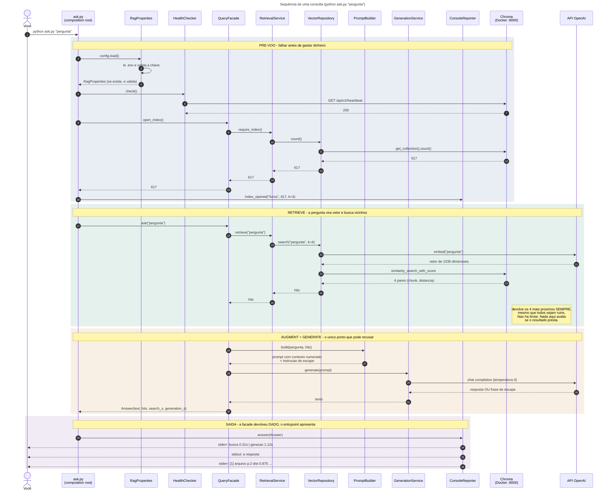
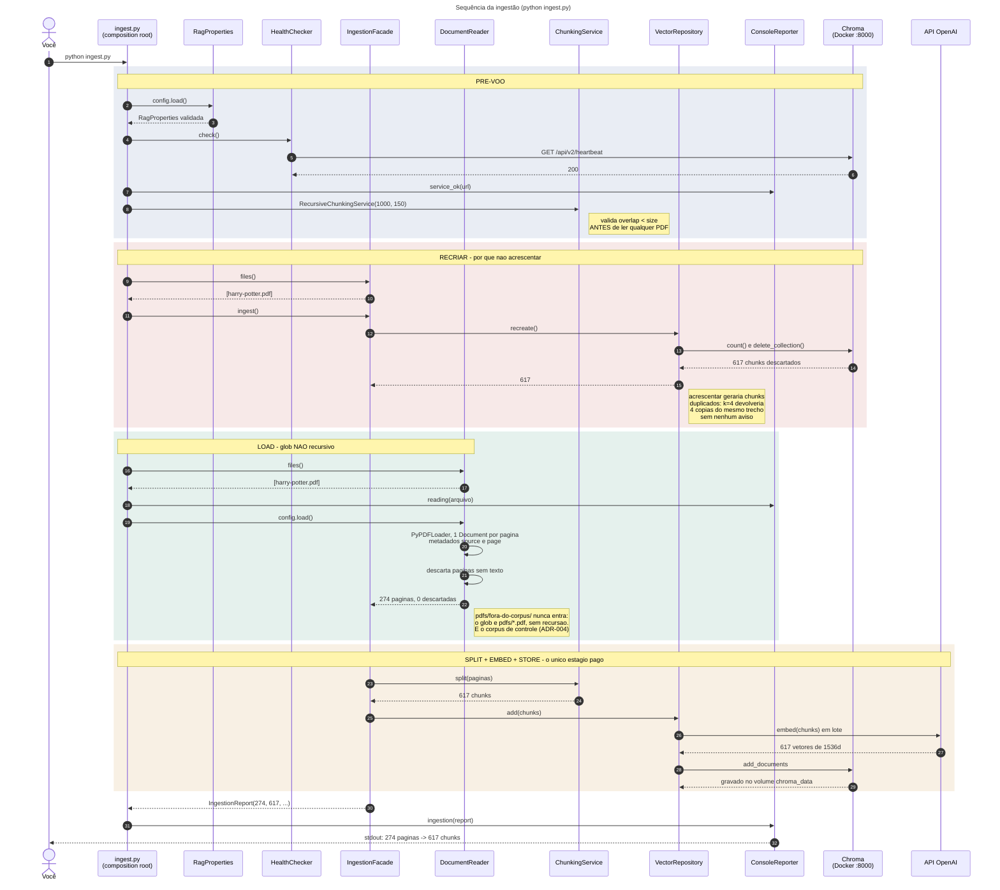
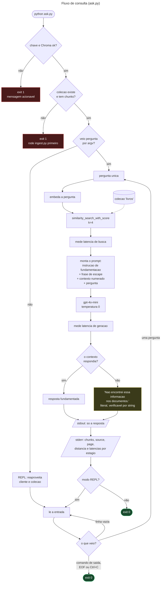
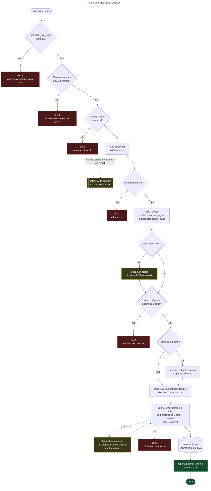
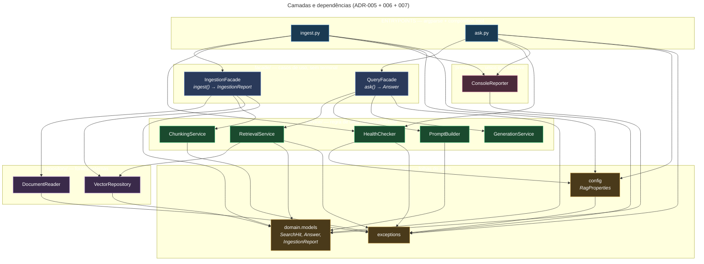

<!-- GERADO por gerar.py a partir de _relatorio.md e mermaid/*.mmd. Não edite este
     arquivo: edite _relatorio.md e rode `python docs/domains/rag/diagrams/gerar.py`. -->

# Relatório de diagramas — domínio `rag`

Estado em 25/07/2026, após o ADR-005 (segregação por responsabilidade).

> **Para ver os diagramas no VS Code:** abra este arquivo e aperte `Ctrl+Shift+V`.
> A extensão `bierner.markdown-mermaid` renderiza Mermaid **apenas** dentro do Markdown
> Preview, ou seja, só em blocos ```mermaid dentro de `.md`. Abrir um `.mmd` solto e
> apertar `Ctrl+Shift+V` não faz nada, e essa é a pegadinha mais comum.
>
> Os `.mmd` em `mermaid/` continuam sendo a fonte de verdade. Este arquivo embute cópias,
> geradas por `gerar.py`.

Os diagramas descrevem três coisas diferentes. **Sequência** mostra a ordem temporal: quem
chama quem, e quando. **Fluxograma** mostra a lógica: as decisões e os desvios.
**C4** mostra a estrutura: que peças existem. Uma refatoração muda o C4 e não muda a
sequência nem o fluxo, e foi exatamente o que aconteceu com o ADR-005.

## Inventário

| Arquivo | Tipo | O que responde | Validado |
| --- | --- | --- | --- |
| `mermaid/sequencia-consulta.mmd` | sequência | Ordem exata de uma pergunta, do argv à resposta | parser Mermaid 11 |
| `mermaid/sequencia-ingestao.mmd` | sequência | Ordem exata de uma indexação | parser Mermaid 11 |
| `mermaid/consulta.mmd` | fluxograma | Decisões e desvios da consulta | parser Mermaid 11 |
| `mermaid/ingestao.mmd` | fluxograma | Decisões e pontos de falha da ingestão | parser Mermaid 11 |
| `mermaid/componentes.mmd` | estrutura | Quem importa quem, extraído do código por AST | parser Mermaid 11 |
| `c4/contexto.puml` | C4 nível 1 | Quem usa o sistema e de que ele depende | PlantUML 1.2026.6, PNG conferido |
| `c4/container.puml` | C4 nível 2 | Que unidades executáveis existem | PlantUML 1.2026.6, PNG conferido |
| `c4/componente.puml` | C4 nível 3 | Os dez módulos de `rag/` e suas relações | PlantUML 1.2026.6, PNG conferido |

---

## 1. A sequência de uma consulta

**Comece por aqui se o objetivo é entender como o RAG funciona.** É o diagrama que mostra
a ordem real das chamadas, incluindo os dois momentos em que se fala com a OpenAI.



Quatro coisas que este diagrama revela e que não são óbvias lendo o código:

**A OpenAI é chamada duas vezes por pergunta, não uma.** A primeira, no passo do
`embed`, converte a sua pergunta em vetor para poder buscar. A segunda gera a resposta.
Quem paga a primeira é a busca, e ela é barata; a segunda é a cara.

**A conversão da pergunta em vetor acontece dentro de `store`, não em `retrieval`.** O
`embedding_function` foi injetado no adaptador do Chroma, então quem dispara a chamada é a
camada de persistência. É o único ponto do desenho onde a responsabilidade fica menos
óbvia do que os nomes dos módulos sugerem.

**O Chroma devolve 4 chunks sempre.** Não existe um passo entre a busca e o prompt que
descarte resultado ruim. Se a resposta não estiver no corpus, ele devolve os 4 menos
irrelevantes, com distância alta, e segue em frente.

**A única coisa capaz de recusar é o LLM.** A caixa da decisão está no final, depois da
geração, não depois da busca. Isso é a definição de Naive RAG: nada no caminho avalia a
qualidade da recuperação. O grading do Projeto 5 é justamente inserir essa avaliação
entre a busca e o prompt.

---

## 2. A sequência da ingestão



O ponto que mais surpreende aqui é a ordem: **a coleção é apagada antes dos PDFs serem
lidos.** Parece arriscado, e é deliberado. Se a leitura falhar, você fica sem índice, o
que é ruidoso e óbvio. A alternativa (ler primeiro, apagar depois) deixaria o índice
antigo intacto durante uma falha parcial, e você poderia consultar dados velhos achando
que reindexou.

---

## 3. O fluxo da consulta, com as decisões

A sequência mostra a ordem; o fluxograma mostra os desvios.



---

## 4. O fluxo da ingestão, com os pontos de falha



Os seis nós vermelhos são todos os jeitos de a ingestão terminar mal, e todos encerram com
código 1 e mensagem que nomeia o comando de correção. Nenhum deles propaga traceback de
biblioteca.

---

## 5. A estrutura: os dez módulos

Este grafo não foi desenhado de memória. Foi extraído do código percorrendo a AST de cada
arquivo e coletando os `import` internos. Se ele diverge do código, o código mudou.



Três propriedades que o grafo prova:

**É acíclico.** `erros` e `store` são folhas; nada aponta de volta para os entrypoints.
Dependência circular é o defeito mais comum em decomposições feitas às pressas, e não há
nenhuma aqui.

**As duas arestas tracejadas são o único ponto discutível.** `prompting` e `reporting`
importam `store` apenas pelo tipo `Achado`, o par (chunk, distância). Não é dependência de
camada, é dependência de forma de dado. A alternativa seria um décimo primeiro módulo só
para tipos. Ficou como está porque o módulo que define o `Protocol` também define o tipo
que ele devolve.

**Cada módulo tem uma razão única para mudar:**

| Módulo | Muda quando |
| --- | --- |
| `erros` | surge uma nova classe de falha |
| `config` | muda um parâmetro ou a fonte de configuração |
| `preflight` | muda o que precisa estar no ar |
| `loading` | é preciso suportar outro formato de arquivo |
| `chunking` | muda a estratégia de divisão |
| `store` | troca o armazém vetorial |
| `retrieval` | muda `k`, ordenação ou filtro |
| `prompting` | muda a instrução ou o formato do contexto |
| `generation` | troca de provedor ou de modelo |
| `reporting` | muda o formato ou o destino do diagnóstico |

---

## 6. C4

Renderizados e conferidos. Os PNG estão versionados ao lado dos `.puml` para poderem ser
vistos sem instalar nada.

| Nível | Fonte | Render |
| --- | --- | --- |
| 1 — Contexto | [`c4/contexto.puml`](c4/contexto.puml) | [`c4/contexto.png`](c4/contexto.png) |
| 2 — Container | [`c4/container.puml`](c4/container.puml) | [`c4/container.png`](c4/container.png) |
| 3 — Componente | [`c4/componente.puml`](c4/componente.puml) | [`c4/componente.png`](c4/componente.png) |


---

## Duas invariantes desenhadas de propósito

**`pdfs/fora-do-corpus/` aparece nos diagramas como ausente.** No `ingestao.mmd` é um nó
alcançado por aresta tracejada com a nota "nunca entra"; no `container.puml` é um
container com a relação "ausente por construção". Desenhar algo que não acontece parece
estranho, e é deliberado: essa ausência é o mecanismo do teste negativo de grounding
(ADR-004), e é frágil. Quem trocar o glob por recursivo destrói o teste em silêncio. O
diagrama existe para que a quebra fique visível numa revisão.

**A retentativa é do SDK, não nossa.** O `ingestao.mmd` mostra o laço de backoff
etiquetado como "do próprio SDK da OpenAI". Uma versão anterior deste diagrama sugeria um
laço implementado à mão, o que teria levado alguém a procurar no código um `for` de
retentativa que não existe.

---

## Como regenerar

```bash
# Este relatório, a partir dos .mmd
python docs/domains/rag/diagrams/gerar.py

# C4 (precisa de Java; baixe o jar uma vez de github.com/plantuml/plantuml/releases)
java -jar plantuml.jar -tpng -o . docs/domains/rag/diagrams/c4/*.puml
```

O `mermaid-cli` **não funciona neste ambiente**: depende de um Chromium headless via
Puppeteer que não inicia aqui, e falha com código 1 sem mensagem. A validação de sintaxe
foi feita pelo parser do Mermaid 11 diretamente, sem navegador.

---

## O que estes diagramas deliberadamente não mostram

Escalabilidade, disponibilidade, autenticação e tracing distribuído. Não por omissão: o
sistema tem um usuário, roda local e não expõe rede. O HLD registra a ausência como
decisão, e desenhar caixas vazias de "load balancer" seria pior que não desenhar.
